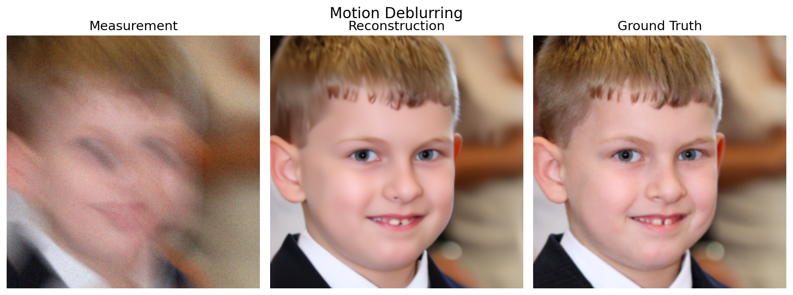

<!-- ===== ORIGINAL =====
# ddiff-cvpr
[CVPR 2026] Dual Ascent Diffusion for Inverse Problems
===== END ORIGINAL ===== -->

# Dual Ascent Diffusion for Inverse Problems

<p align="center">
  <b>CVPR 2026</b>
</p>

<p align="center">
  <a href="https://soniaminseokim.github.io/">Minseo (Sonia) Kim</a><sup>1</sup>,
  <a href="https://axlevy.com/">Axel Levy</a><sup>1</sup>,
  <a href="https://stanford.edu/~gordonwz/">Gordon Wetzstein</a><sup>1</sup>
  <br>
  <sup>1</sup>Stanford University
</p>

<p align="center">
  <a href="https://soniaminseokim.github.io/ddiff/"></a>
  <a href="https://www.arxiv.org/abs/2505.17353"></a>
  <a href="https://www.arxiv.org/pdf/2505.17353"></a>
</p>

> **TL;DR:** We solve maximum-a-posteriori (MAP) inverse problems with diffusion-model priors using a **dual ascent optimization** framework, yielding higher-quality, faster, and more noise-robust reconstructions than the state of the art.

## Abstract

Ill-posed inverse problems are fundamental in many domains, ranging from astrophysics to medical imaging. Emerging diffusion models provide a powerful prior for solving these problems. Existing maximum-a-posteriori (MAP) or posterior sampling approaches, however, rely on different computational approximations, leading to inaccurate or suboptimal samples. To address this issue, we introduce a new approach to solving MAP problems with diffusion model priors using a dual ascent optimization framework. Our framework achieves better image quality as measured by various metrics for image restoration problems, it is more robust to high levels of measurement noise, it is faster, and it estimates solutions that represent the observations more faithfully than the state of the art.

## Links

- 📄 **Paper (arXiv):** https://www.arxiv.org/abs/2505.17353
- 📑 **PDF:** https://www.arxiv.org/pdf/2505.17353
- 🌐 **Project Page:** https://soniaminseokim.github.io/ddiff/

## 💻 Local Setup

### 1. Prepare the environment

- python >= 3.9
- PyTorch >= 2.0 with a working CUDA setup

```bash
# in ddiff-cvpr folder
conda create -n ddiff python=3.10
conda activate ddiff

pip install -r requirements.txt

# (optional) install PyTorch with the CUDA version matching your system, e.g.
# pip install torch torchvision --index-url https://download.pytorch.org/whl/cu121
```

### 2. Download pretrained checkpoints & test datasets

The pretrained diffusion models and 100-image test sets are the same public ones used by [DPS](https://github.com/DPS2022/diffusion-posterior-sampling) and [DAPS](https://github.com/zhangbingliang2019/DAPS). You can download **all of them** with:

```bash
sh download.sh
```

This places:

- `models/ffhq_10m.pt` — FFHQ 256×256 pixel-space DDPM (from DPS)
- `models/imagenet256.pt` — ImageNet 256×256 pixel-space DDPM (from [guided-diffusion](https://github.com/openai/guided-diffusion))
- `datasets/test-ffhq/`, `datasets/test-imagenet/` — 100 test images each (from DAPS)

<details>
  <summary><strong>(Optional) nonlinear deblurring setup</strong></summary>

The `nonlinear_blur` task uses the kernel-space blur model from [bkse](https://github.com/VinAIResearch/blur-kernel-space-exploring). Clone it into the repo root and download its pretrained weights ([GOPRO_wVAE.pth](https://drive.google.com/file/d/1vRoDpIsrTRYZKsOMPNbPcMtFDpCT6Foy/view)):

```bash
# in ddiff-cvpr folder
git clone https://github.com/VinAIResearch/blur-kernel-space-exploring bkse
mkdir -p bkse/experiments/pretrained
gdown https://drive.google.com/uc?id=1vRoDpIsrTRYZKsOMPNbPcMtFDpCT6Foy -O bkse/experiments/pretrained/GOPRO_wVAE.pth
```

(If `bkse/` already exists, `download.sh` fetches the weights for you.)

</details>

### 3. Quick demo: one sample per task

The `test_results/` folder is a ready-to-run tutorial. It runs DDiff on a single FFHQ test image (included in the repo at `test_results/input/`) for **all 8 tasks** using the paper's hyperparameters, and saves one comparison figure (measurement | reconstruction | ground truth) per task:

```bash
# requires models/ffhq_10m.pt from step 2
bash test_results/run_all_tasks.sh

# to select a specific GPU:
GPU=1 bash test_results/run_all_tasks.sh
```

Figures are written to `test_results/<task>_comparison.png`, with raw outputs and a metrics CSV under `test_results/<task>/`. Pre-generated figures are included in the repo so you can preview the expected results before running anything — for example, Motion deblurring:



Note: the `nonlinear_blur` task requires the optional [bkse](#2-download-pretrained-checkpoints--test-datasets) setup above; without it, that task is reported as failed and the remaining tasks still run.

### 4. Full evaluation with DDiff

`ddiff_sample.py` runs DDiff on a folder of test images, saves the measurements, reconstructions, and ground truths, and reports PSNR / SSIM / LPIPS. For example, Gaussian deblurring on FFHQ:

```bash
python3 ddiff_sample.py \
    --dataset ffhq \
    --testdata_path "datasets/test-ffhq" \
    --output_path "results/ddiff_deconv_ffhq/" \
    --task deconv \
    --forward_step 50 \
    --scale 2.9
```

Measurements, ground-truth images, reconstructions, and a per-image metrics CSV are saved under `--output_path`. All measurements use additive Gaussian noise with σ = 0.05 (matching the paper).

#### Command template

```bash
python3 ddiff_sample.py \
    --dataset {ffhq, imagenet} \
    --testdata_path {PATH_TO_TEST_IMAGES} \
    --output_path {OUTPUT_FOLDER} \
    --task {TASK_NAME} \
    --mask_type {box, random}   # inpainting only \
    --forward_step {NOISE_THRESHOLD_t0} \
    --scale {STEP_SIZE_gamma0} \
    --num_runs {RUNS_PER_IMAGE} # best-PSNR run is kept (used for phase retrieval) \
    --batch_size {NUM_TEST_IMAGES} \
    --gpu {GPU_ID}
```

#### Supported tasks and hyperparameters

`--scale` (measurement step size γ₀) and `--forward_step` (noise threshold t₀) follow Appendix H of the paper:

| Task | `--task` | FFHQ (`--scale` / `--forward_step`) | ImageNet (`--scale` / `--forward_step`) |
| --- | --- | --- | --- |
| Super resolution 4× | `downsample` | 18 / 1 | 18 / 1 |
| Inpainting (128×128 box) | `inpaint --mask_type box` | 30 / 1 | 50 / 1 |
| Inpainting (70% random) | `inpaint --mask_type random` | 50 / 1 | 50 / 1 |
| Gaussian deblurring | `deconv` | 2.9 / 50 | 1.8 / 50 |
| Motion deblurring | `motion_deblur` | 2.9 / 80 | 1.5 / 80 |
| Phase retrieval | `phase_retrieval` | 38 / 1 | 38 / 1 |
| Nonlinear deblurring | `nonlinear_blur` | 2.5 / 120 | 2.5 / 120 |
| High dynamic range | `hdr` | 3.5 / 120 | 3.8 / 100 |

Full commands for every task are provided in `run_ffhq.sh` and `run_imagenet.sh`. Following the paper, phase retrieval is run with `--num_runs 5` and the best result is reported due to the intrinsic instability of the task.

#### Reproduction notes

A few implementation details that matter when reproducing the paper's numbers:

- **Phase retrieval image range ([-1,1]).** Fourier magnitude measurements are generated directly from images in **[-1,1]** (no mapping to [0,1]), following the DPS phase-retrieval operator — not the DAPS convention, which maps images to [0,1] first. Note that in the [-1,1] convention the global sign flip is an exact symmetry of the Fourier magnitudes (|F(−x)| = |F(x)|), so individual runs can collapse onto a sign-inverted solution and per-image success is quite variable. The [0,1] variant is more stable per-run because the +0.5 offset breaks the sign ambiguity; either convention is a reasonable choice to experiment with, whichever works better for your data.
- **Best-of-5 protocol.** The reported phase retrieval numbers use the best of 5 runs per image (`--num_runs 5`), averaged over the 100 validation images. Because success is image- and seed-dependent, we recommend evaluating over the full validation set rather than a single image — some individual images (e.g., FFHQ `00000.png`) can fail across many seeds at σ = 0.05 under the [-1,1] convention while others succeed almost every run.
- **Normalized measurement gradient.** The reported experiments use the normalized measurement gradient as implemented in this code: `x ← v − γₜ · ∇/‖∇‖` (see `conditioning` in `ddiff_sample.py`). The unnormalized form written in Eq. 10 of the paper should be read with γₜ absorbing the gradient normalization; the γ₀ values in the table above correspond to the normalized parameterization.
- **High-noise experiments.** The measurement-noise sweep (Fig. 3/4 of the paper) uses exactly the same hyperparameters as σ = 0.05 (for FFHQ phase retrieval: γ₀ = 38, t_γ = 90, a = 3.3, b = 0.1, t₀ = 1, best-of-5), unchanged across all noise levels — only the measurement noise standard deviation `sigma` in `ddiff_sample.py` is changed.

## Repository structure

```
ddiff-cvpr/
├── ddiff_sample.py      # DDiff inference + evaluation (Algorithm 1 in the paper)
├── run_ffhq.sh          # per-task commands for FFHQ
├── run_imagenet.sh      # per-task commands for ImageNet
├── download.sh          # checkpoints + test datasets
├── requirements.txt     # python dependencies
├── test_results/        # quick demo: one sample per task + comparison figures
│   ├── run_all_tasks.sh #   runs all 8 tasks on one test image
│   ├── make_plot.py     #   builds the 3-column comparison figure
│   ├── input/           #   the FFHQ test image used by the demo
│   └── *_comparison.png #   pre-generated expected outputs
├── guided_diffusion/    # UNet and diffusion utilities (from guided-diffusion / DPS)
├── util/                # image utilities, resizer, logger
└── motionblur/          # motion blur kernel generation
```

## Acknowledgements

This codebase builds on [DPS](https://github.com/DPS2022/diffusion-posterior-sampling), [guided-diffusion](https://github.com/openai/guided-diffusion), [DAPS](https://github.com/zhangbingliang2019/DAPS), [motionblur](https://github.com/LeviBorodenko/motionblur), and [bkse](https://github.com/VinAIResearch/blur-kernel-space-exploring). We thank the authors for releasing their code and pretrained models.

## Citation

If you find this work useful, please consider citing:

```bibtex
@inproceedings{kim2026dualascentdiffusion,
  title={Dual Ascent Diffusion for Inverse Problems},
  author={Minseo Kim and Axel Levy and Gordon Wetzstein},
  booktitle={Proceedings of the IEEE/CVF Conference on Computer Vision and Pattern Recognition (CVPR)},
  year={2026},
  url={https://arxiv.org/abs/2505.17353},
}
```
